**Práctica 4**

**Usaremos un proyecto desarrollado para gestionar productos, analizaremos un total de 8 archivos.**

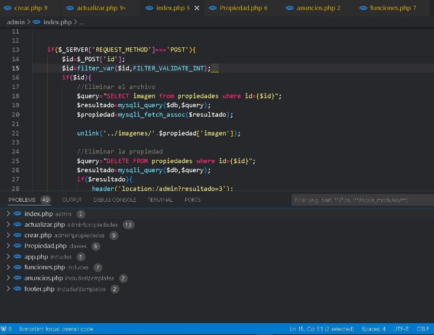

**Reporte de SonarLint**

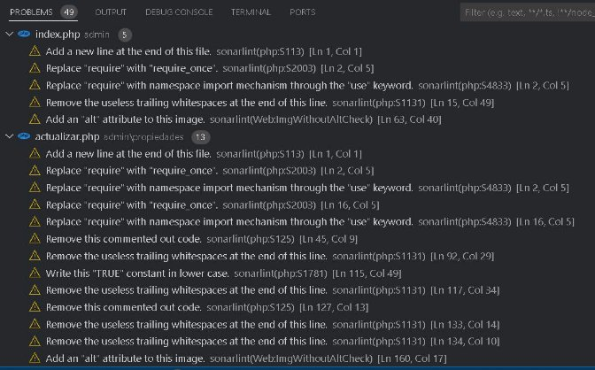

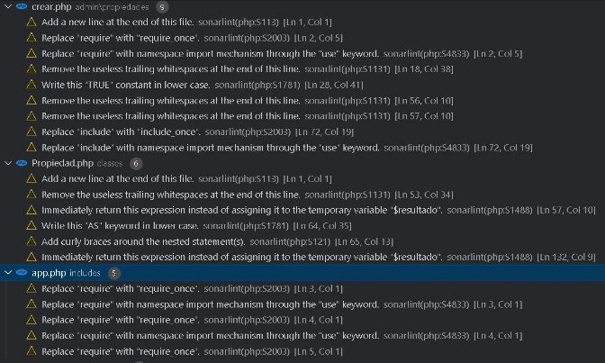

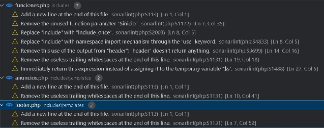

**Durante esta revisión no se encontró ningún Bug o code smell, sin embargo se encontraron un total de 49 violaciones a las prácticas Clean Code.**

**Analizaremos y resolveremos 3 de estas infracciones:**

1) **Violación de l regla: (Web:ImgWithoutAltCheck)**

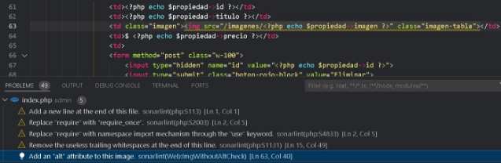

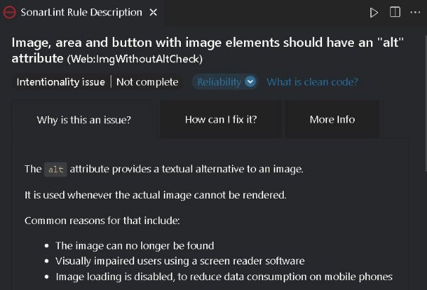**Es importante colocar el atributo “alt” cuando se va a mostrar una imagen, ya que es un texto de referencia en caso no cargue la imagen.**

**Código corregido**

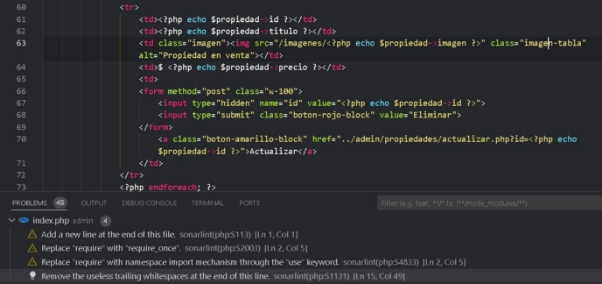

Agregamos el atributo “alt” y ya no nos detecta como error el código.

2) **Violación de la regla S1781**

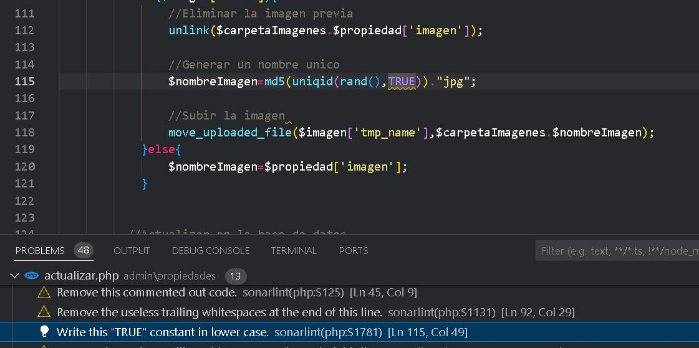

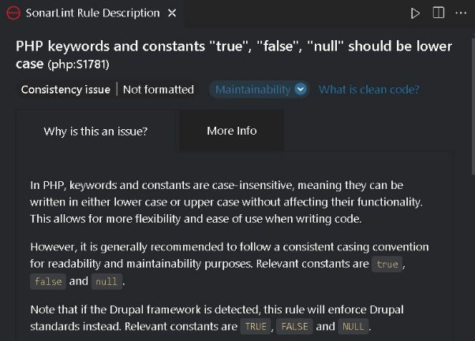

Se sabe que en php se puede escribir las palabras clave true, false o null tanto en mayúscula y en minúscula, sin embargo como estándar que se debe seguir se debe escribir todos estos en minúsculos, para tener una mayor consistencia en el código.

**Código corregido**

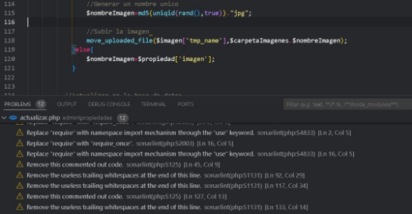

3) **Violación de la regla S2003![ref1]**

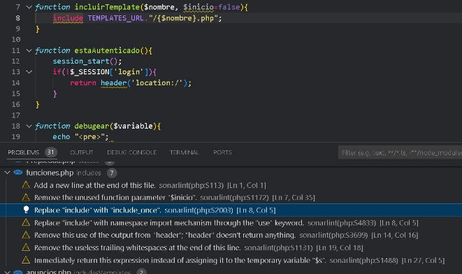

Incluir el mismo archivo varias veces podría tener resultados impredecibles, por lo que se prefieren las versiones \_once.![ref2]

**Código corregido**

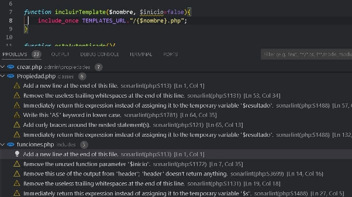

[ref1]: Aspose.Words.0a319fde-cbee-411d-9f99-5f52b433186c.011.jpeg
[ref2]: Aspose.Words.0a319fde-cbee-411d-9f99-5f52b433186c.013.jpeg
